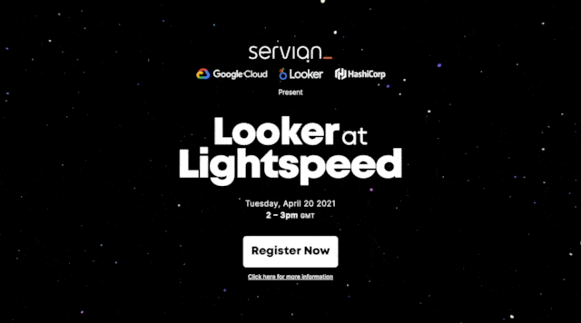

# Looker at Lightspeed

🔗 https://lightspeed.builders

---



Special thanks and credit to [this CodePen](https://codepen.io/quentin-feret/pen/KKazpBm) for the original idea and
creation of the lightspeed effect.

## Development

The page was developed with Svelte, Three.js and Tailwind CSS.

Clone the repository and run `npm install` to install the above dependencies and then run the commands below to build and/or preview the page on your local machine.

```bash
# start the server and open the app in a new browser tab
npm run dev -- --open

# build assets for deployment
npm run build
```
